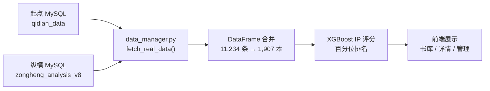
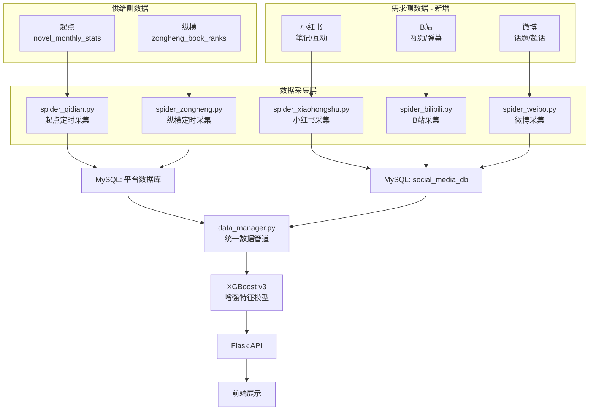

# IP Lumina — 社交声量数据接入与 IP 价值分析系统扩展方案

> **版本**: v1.0 — 2026-02-20  
> **目标**: 在现有网文平台数据（起点/纵横）基础上，接入社交媒体声量数据（小红书/B站/微博），构建 **"供给侧 + 需求侧"** 双维度 IP 价值分析与预测体系。

---

## 一、现状分析

### 1.1 当前数据架构



### 1.2 现有数据字段（供给侧）

| 维度 | 起点字段 | 纵横字段 | 统一命名 |
|---|---|---|---|
| 热度 | `collection_count` | `total_click` | `popularity` |
| 互动 | `recommendation_count` | `total_rec` | `interaction` |
| 营收 | `monthly_tickets_on_list` | `monthly_ticket` | `finance` |
| 粉丝 | `reward_count` | `fan_count` | `fans_count` |
| 周推 | `week_recommendation_count` | `week_rec` | `week_recommend` |

### 1.3 核心缺陷

> [!WARNING]
> 目前所有数据均来自**网文平台内部的供给侧指标**（点击、收藏、月票）。这些数据只能反映"平台内的竞争力"，无法衡量一个 IP 在**大众市场中的真实影响力和改编潜力**。

对比价值判断需要的：

| 维度 | 现有 ✅ | 缺失 ❌ |
|---|---|---|
| 平台内热度 | 收藏/点击/月票/推荐 | — |
| 社交传播力 | — | 小红书笔记数、B站视频播放量 |
| 大众口碑 | — | 评论情感分析、用户讨论热度 |
| 跨平台渗透 | — | 出现在几个平台上的比率 |
| IP 改编信号 | — | 影视/动漫相关讨论、版权交易新闻 |

---

## 二、扩展架构设计

### 2.1 目标架构



### 2.2 新增项目文件结构

```
integrated_system/
├── backend/
│   ├── data_manager.py          # [修改] 接入社交数据
│   ├── social_data_manager.py   # [新增] 社交媒体数据管理器
│   ├── model_trainer.py         # [修改] 增加社交特征
│   ├── api.py                   # [修改] 新增社交声量 API
│   └── spiders/                 # [新增] 爬虫模块目录
│       ├── __init__.py
│       ├── base_spider.py       # 爬虫基类
│       ├── xiaohongshu.py       # 小红书采集
│       ├── bilibili.py          # B站采集
│       ├── weibo.py             # 微博采集
│       └── scheduler.py         # 定时调度器
└── frontend/
    └── src/views/
        └── AdminDashboard.vue   # [修改] 新增"社交声量"Tab
```

---

## 三、数据库扩展设计

### 3.1 新建数据库

```sql
CREATE DATABASE IF NOT EXISTS social_media_db 
    DEFAULT CHARACTER SET utf8mb4 
    DEFAULT COLLATE utf8mb4_unicode_ci;
USE social_media_db;
```

### 3.2 核心表结构

#### 表1: `social_mentions` — 社交平台提及记录

> 每次采集一条，记录某本书在某平台某日的"被提及"情况

```sql
CREATE TABLE social_mentions (
    id BIGINT AUTO_INCREMENT PRIMARY KEY,
    book_title VARCHAR(255) NOT NULL COMMENT '书名（与网文平台数据关联的 Key）',
    book_author VARCHAR(128) DEFAULT NULL COMMENT '作者名（辅助匹配）',
    platform ENUM('xiaohongshu','bilibili','weibo','douyin','zhihu') NOT NULL,
    metric_date DATE NOT NULL COMMENT '采集日期',
    
    -- 量化指标
    mention_count INT DEFAULT 0 COMMENT '提及/笔记/视频数量',
    total_views BIGINT DEFAULT 0 COMMENT '总曝光量（播放/阅读）',
    total_likes INT DEFAULT 0 COMMENT '总点赞',
    total_comments INT DEFAULT 0 COMMENT '总评论',
    total_shares INT DEFAULT 0 COMMENT '总分享/转发',
    total_collects INT DEFAULT 0 COMMENT '总收藏（小红书重要指标）',
    total_danmaku INT DEFAULT 0 COMMENT '总弹幕（B站专属）',
    
    -- 分析指标
    avg_sentiment FLOAT DEFAULT 0.5 COMMENT '平均情感得分 (0=负面, 0.5=中性, 1=正面)',
    hot_keywords TEXT COMMENT '高频关键词 JSON 数组',
    
    -- 元数据
    created_at DATETIME DEFAULT CURRENT_TIMESTAMP,
    
    UNIQUE KEY uk_book_platform_date (book_title, platform, metric_date),
    INDEX idx_date (metric_date),
    INDEX idx_platform (platform)
) ENGINE=InnoDB COMMENT='社交平台提及数据汇总表';
```

#### 表2: `social_posts` — 原始帖子/视频详情

> 存储每一条具体的笔记、视频等原始数据，用于溯源和深度分析

```sql
CREATE TABLE social_posts (
    id BIGINT AUTO_INCREMENT PRIMARY KEY,
    book_title VARCHAR(255) NOT NULL,
    platform ENUM('xiaohongshu','bilibili','weibo','douyin','zhihu') NOT NULL,
    post_id VARCHAR(128) NOT NULL COMMENT '平台原始内容 ID',
    
    -- 内容
    post_title VARCHAR(500) COMMENT '标题',
    post_url VARCHAR(1000) COMMENT '原文链接',
    author_name VARCHAR(128) COMMENT '发布者昵称',
    author_fans INT DEFAULT 0 COMMENT '发布者粉丝数（KOL 识别）',
    content_type ENUM('note','video','article','topic','comment') DEFAULT 'note',
    
    -- 互动
    views BIGINT DEFAULT 0,
    likes INT DEFAULT 0,
    comments INT DEFAULT 0,
    shares INT DEFAULT 0,
    collects INT DEFAULT 0,
    danmaku INT DEFAULT 0,
    
    -- 分析
    sentiment FLOAT DEFAULT 0.5 COMMENT '该条内容的情感得分',
    keywords TEXT COMMENT '提取的关键词',
    is_recommendation BOOLEAN DEFAULT FALSE COMMENT '是否为推书/安利类内容',
    
    published_at DATETIME COMMENT '发布时间',
    collected_at DATETIME DEFAULT CURRENT_TIMESTAMP,
    
    UNIQUE KEY uk_platform_post (platform, post_id),
    INDEX idx_book (book_title),
    INDEX idx_published (published_at)
) ENGINE=InnoDB COMMENT='社交平台原始帖子详情';
```

#### 表3: `social_trends` — 趋势时序数据

> 按周聚合的趋势数据，用于折线图展示

```sql
CREATE TABLE social_trends (
    id BIGINT AUTO_INCREMENT PRIMARY KEY,
    book_title VARCHAR(255) NOT NULL,
    week_start DATE NOT NULL COMMENT '该周的周一日期',
    
    -- 各平台汇总
    xhs_mentions INT DEFAULT 0,
    xhs_interactions INT DEFAULT 0,
    bili_mentions INT DEFAULT 0,
    bili_views BIGINT DEFAULT 0,
    weibo_mentions INT DEFAULT 0,
    weibo_reads BIGINT DEFAULT 0,
    
    -- 综合指标
    social_buzz_score FLOAT DEFAULT 0 COMMENT '社交声量综合评分 (0-100)',
    sentiment_avg FLOAT DEFAULT 0.5,
    
    created_at DATETIME DEFAULT CURRENT_TIMESTAMP,
    
    UNIQUE KEY uk_book_week (book_title, week_start)
) ENGINE=InnoDB COMMENT='社交声量周趋势表';
```

### 3.3 爬虫任务管理表

```sql
-- 在现有用户认证库中增加爬虫任务管理表
CREATE TABLE IF NOT EXISTS ip_lumina_auth.spider_tasks (
    id INT AUTO_INCREMENT PRIMARY KEY,
    task_name VARCHAR(128) NOT NULL,
    platform VARCHAR(32) NOT NULL,
    status ENUM('idle','running','completed','failed') DEFAULT 'idle',
    last_run_at DATETIME,
    next_run_at DATETIME,
    books_crawled INT DEFAULT 0,
    error_message TEXT,
    config JSON COMMENT '爬虫配置参数',
    created_at DATETIME DEFAULT CURRENT_TIMESTAMP
) ENGINE=InnoDB COMMENT='爬虫任务调度表';
```

---

## 四、爬虫采集方案

### 4.1 采集策略总览

| 平台 | 难度 | 采集方式 | 频率 | 每次采集量 |
|---|---|---|---|---|
| **B站** | ⭐⭐ 简单 | 官方 API + Scrapy | 每日 1 次 | Top 200 书名搜索 |
| **微博** | ⭐⭐⭐ 中等 | 微博 API + Cookie | 每日 1 次 | Top 200 话题 |
| **小红书** | ⭐⭐⭐⭐ 较难 | DrissionPage 模拟浏览 | 每 2 天 1 次 | Top 100 书名 |

### 4.2 B站采集方案（推荐优先实施）

B站有相对开放的搜索 API，是最佳的切入平台。

```python
# spiders/bilibili.py 核心逻辑示意
import requests

class BilibiliSpider:
    """B站视频搜索采集器"""
    
    SEARCH_API = "https://api.bilibili.com/x/web-interface/search/type"
    
    def search_novel(self, book_title: str) -> dict:
        """搜索某本小说相关的B站视频"""
        params = {
            'search_type': 'video',
            'keyword': f'{book_title} 小说',
            'page': 1,
            'page_size': 20,
            'order': 'totalrank'  # 按综合排序
        }
        headers = {
            'User-Agent': 'Mozilla/5.0 ...',
            'Referer': 'https://www.bilibili.com'
        }
        
        resp = requests.get(self.SEARCH_API, params=params, headers=headers)
        data = resp.json()
        
        results = data.get('data', {}).get('result', [])
        
        # 汇总统计
        total_play = sum(v.get('play', 0) for v in results)
        total_danmaku = sum(v.get('video_review', 0) for v in results)
        total_likes = sum(v.get('like', 0) for v in results)
        
        return {
            'mention_count': len(results),
            'total_views': total_play,
            'total_danmaku': total_danmaku,
            'total_likes': total_likes,
            'posts': results
        }
```

### 4.3 小红书采集方案

小红书反爬较强，推荐使用 DrissionPage（基于 Chromium 的无头浏览器框架）。

```python
# spiders/xiaohongshu.py 核心逻辑示意
from DrissionPage import ChromiumPage

class XiaohongshuSpider:
    """小红书笔记搜索采集器"""
    
    def __init__(self):
        self.page = ChromiumPage()
    
    def search_novel(self, book_title: str) -> dict:
        """搜索某本小说相关的小红书笔记"""
        self.page.get(
            f'https://www.xiaohongshu.com/search_result?keyword={book_title}'
        )
        self.page.wait(3)
        
        notes = self.page.eles('.note-item')  # CSS 选择器需实际调试
        
        results = []
        for note in notes[:20]:
            results.append({
                'title': note.ele('.title').text,
                'likes': self._parse_count(note.ele('.like-count').text),
                'collects': self._parse_count(note.ele('.collect-count').text),
            })
        
        return {
            'mention_count': len(results),
            'total_likes': sum(r['likes'] for r in results),
            'total_collects': sum(r['collects'] for r in results),
            'posts': results
        }
```

### 4.4 定时调度

```python
# spiders/scheduler.py
from apscheduler.schedulers.background import BackgroundScheduler

scheduler = BackgroundScheduler()

# B站：每天凌晨 2:00 采集
scheduler.add_job(crawl_bilibili, 'cron', hour=2, minute=0)

# 小红书：每 2 天凌晨 3:00 采集
scheduler.add_job(crawl_xiaohongshu, 'cron', day='*/2', hour=3)

# 微博：每天凌晨 4:00 采集
scheduler.add_job(crawl_weibo, 'cron', hour=4, minute=0)
```

### 4.5 采集优先级

不需要采集全部 1907 本书。建议按 IP 评分排序取 **Top 200** 高价值书籍优先采集：

```python
def get_priority_books(limit=200):
    """获取需要优先采集社交数据的高价值书名"""
    from data_manager import data_manager as dm
    top = dm.df.sort_values('IP_Score', ascending=False)
    unique = top.drop_duplicates(subset=['title', 'author'])
    return unique[['title', 'author']].head(limit).to_dict('records')
```

---

## 五、模型增强方案

### 5.1 新增特征维度

在现有 XGBoost 模型的 29 个特征基础上，增加 **8 个社交声量特征**：

| # | 特征名 | 计算方式 | 说明 |
|---|---|---|---|
| 30 | `social_buzz_score` | 加权各平台声量 | 综合社交热度评分 (0-100) |
| 31 | `xhs_heat` | 小红书笔记数 × 互动系数 | 小红书热度 |
| 32 | `bili_heat` | B站视频数 × 播放量系数 | B站热度 |
| 33 | `weibo_heat` | 微博话题阅读量 | 微博热度 |
| 34 | `cross_platform_count` | 出现平台数 (0-5) | 跨平台渗透广度 |
| 35 | `social_sentiment` | 各平台情感均值 | 大众口碑 (0-1) |
| 36 | `kol_mention_ratio` | 大V提及占比 | KOL 背书程度 |
| 37 | `buzz_momentum` | 近30天声量变化率 | 热度趋势方向 |

### 5.2 社交声量综合评分公式

```python
def calculate_social_buzz_score(metrics: dict) -> float:
    """
    计算社交声量综合评分 (0-100)
    
    权重分配:
    - 小红书: 35% (种草属性最强，与IP改编消费决策最相关)
    - B站:    30% (二次元/动漫改编的风向标)
    - 微博:   20% (大众传播广度)
    - 其他:   15% (知乎/豆瓣等长尾平台)
    """
    weights = {
        'xiaohongshu': 0.35,
        'bilibili': 0.30,
        'weibo': 0.20,
        'other': 0.15
    }
    
    xhs_score = percentile_rank(metrics.get('xhs_interactions', 0))
    bili_score = percentile_rank(metrics.get('bili_views', 0))
    weibo_score = percentile_rank(metrics.get('weibo_reads', 0))
    
    return (xhs_score * weights['xiaohongshu'] + 
            bili_score * weights['bilibili'] + 
            weibo_score * weights['weibo'])
```

### 5.3 IP 评分模型升级路径


---

## 六、前端可视化设计

### 6.1 管理端新增 "社交声量" Tab

| 模块 | 内容 |
|---|---|
| **声量排行榜** | Top 20 社交热度最高的书，按 `social_buzz_score` 排序 |
| **平台分布饼图** | 各社交平台的提及占比 |
| **趋势折线图** | 选定书籍在各平台的周声量趋势 |
| **情感分析仪表盘** | 正面/中性/负面评价占比 |
| **爬虫任务监控** | 各平台采集状态、最后运行时间、错误日志 |

### 6.2 书籍详情页增强

在 `BookDetailView.vue` 中新增 **"社交声量 Social"** Tab：

| 组件 | 展示内容 |
|---|---|
| 平台热力卡片 | 小红书/B站/微博各自的提及数、互动数 |
| 声量趋势图 | 近 90 天的跨平台声量变化折线 |
| 关键词云 | 社交媒体中高频提及的关键词 |
| KOL 列表 | 提及该书的头部创作者及其粉丝量 |
| 原始内容列表 | 可点击跳转的笔记/视频原文链接 |

---

## 七、API 接口规划

```
# 社交声量数据接口
GET  /api/social/buzz-ranking           # 社交声量 Top 排行
GET  /api/social/book/:title            # 单本书的社交数据汇总
GET  /api/social/trends/:title          # 单本书的声量趋势数据
GET  /api/social/platforms-overview     # 各平台采集概览

# 爬虫管理接口 (管理员)
GET  /api/admin/spider/tasks            # 查看所有爬虫任务状态
POST /api/admin/spider/trigger          # 手动触发某平台的采集
GET  /api/admin/spider/logs             # 查看采集日志
```

---

## 八、分阶段执行计划

### 阶段一：B站数据接入（1-2周）

> [!TIP]
> 推荐从 B站开始，因为它有公开 API，反爬压力最小，是最低风险的切入点。

- [ ] 创建 `social_media_db` 数据库和三张核心表
- [ ] 编写 `spiders/bilibili.py` B站搜索采集器
- [ ] 编写 `social_data_manager.py` 社交数据管理器
- [ ] 新增 `/api/social/*` 后端接口
- [ ] 管理端新增"社交声量"Tab 基础界面
- [ ] 对 Top 50 书名执行首次采集并验证

### 阶段二：小红书 + 微博接入（2-3周）

- [ ] 安装 DrissionPage 和配置浏览器环境
- [ ] 编写 `spiders/xiaohongshu.py` 小红书采集器
- [ ] 编写 `spiders/weibo.py` 微博采集器
- [ ] 实现情感分析模块（基于 SnowNLP 或 BERT）
- [ ] 实现 `social_buzz_score` 综合评分计算
- [ ] 书籍详情页增加 "社交声量" Tab
- [ ] 扩大采集范围到 Top 200 书名

### 阶段三：模型融合 + 定时调度（1-2周）

- [ ] XGBoost 模型增加 8 个社交特征并重新训练
- [ ] 配置 APScheduler 定时采集任务
- [ ] 管理端增加爬虫任务监控面板
- [ ] A/B 测试对比新旧模型的预测准确率

### 阶段四：高级分析功能（持续迭代）

- [ ] KOL 识别与影响力分析
- [ ] 热度爆发预警系统（声量突增检测）
- [ ] IP 改编可行性自动评估报告
- [ ] 竞品对标分析（同题材书的社交数据横向对比）

---

## 九、环境依赖

```bash
pip install DrissionPage      # 小红书爬虫（无头浏览器）
pip install apscheduler        # 定时任务调度
pip install snownlp            # 中文情感分析
pip install requests           # HTTP 请求
pip install fake-useragent     # UA 伪装
```

- Chrome / Chromium 浏览器（DrissionPage 依赖）
- MySQL 8.0+（新建 `social_media_db`）
- 稳定的网络环境

---

## 十、风险与应对

| 风险 | 影响 | 应对策略 |
|---|---|---|
| 小红书反爬封禁 | 采集中断 | DrissionPage 模拟 + IP 代理池 + 随机延时 |
| B站 API 限流 | 数据不全 | 控制频率 ≤ 5次/秒 + 错误重试 |
| 书名匹配歧义 | 数据错乱 | 书名+作者名组合匹配 + 人工抽样校验 |
| 社交数据噪声 | 影响模型 | 过滤低质量内容 + 情感分析清洗 |
| 存储增长快 | 磁盘压力 | `social_posts` 保留 90 天，历史转冷存储 |

---

> [!IMPORTANT]
> **建议的第一步行动**：先执行阶段一的 B站数据接入，这是最低成本的验证路径。完成后可以快速看到社交数据维度的价值，再决定是否投入更多资源到小红书和微博的采集。
